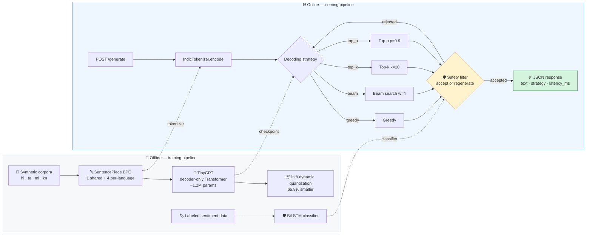
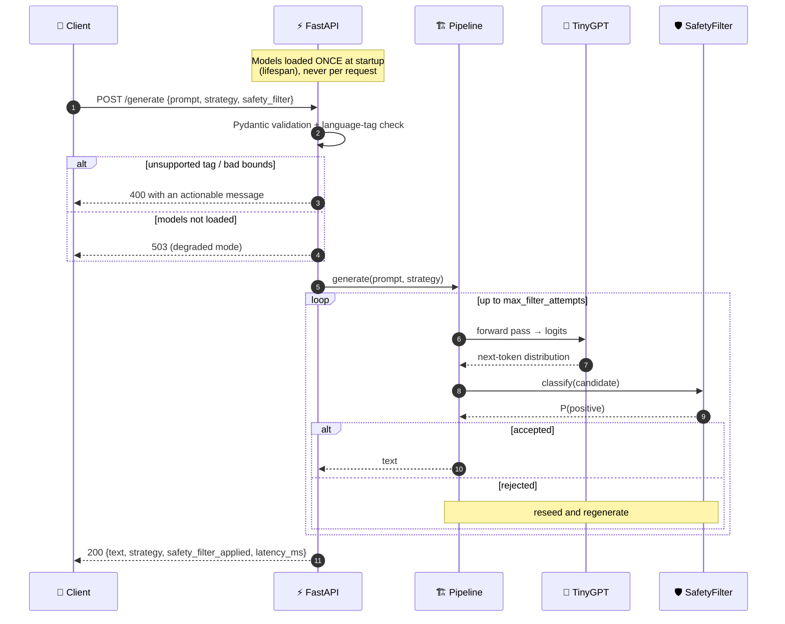

<div align="center">

# 🪔 Multilingual Indic Generation Service

### Tokenization → Generation → Decoding → Safety → Compression → Serving

**An end-to-end generative NLP system for four Indic languages, built from scratch and served over HTTP.**

<samp>हिन्दी · తెలుగు · മലയാളം · ಕನ್ನಡ</samp>

<br/>

[](https://www.python.org/)
[](https://pytorch.org/)
[](https://fastapi.tiangolo.com/)
[](https://www.docker.com/)

[](#-10-tests-tests)
[](#-what-is-built-from-scratch)
[](#-1-tokenization--four-languages-two-implementations)
[](#-6-model-compression)
[](#-2-language-model--one-model-four-scripts)

</div>

---

## ⚡ TL;DR

> A single ~1.2M-parameter Transformer, trained from scratch, generates coherent
> text in **Hindi, Telugu, Malayalam, and Kannada** from a language tag alone —
> then a from-scratch BiLSTM classifier gates the output for safety, and the
> whole thing is served as a production-shaped FastAPI service in a Docker
> container.

<table>
<tr>
<td width="33%" valign="top">

### 🧠 Built, not imported
BPE, Transformer, all 4 decoding
strategies, AdamW and label smoothing
are implemented **from scratch** — no
`model.generate()`, no `torch.optim`
in the custom-training path.

</td>
<td width="33%" valign="top">

### 📊 Measured, not claimed
Every number in this README comes
from a **real run**: perplexity 94.6 → 2.07,
self-BLEU per strategy, tokenizer
efficiency per language, 65.8% size
reduction from int8 quantization.

</td>
<td width="33%" valign="top">

### 🚢 Shipped, not notebooked
FastAPI service, one-time model load,
degraded-mode health checks, non-root
Docker image, centralized config,
`weights_only` checkpoint loading and
**60 passing tests**.

</td>
</tr>
</table>

---

## 🎯 The problem this models

Regional-language products in India — assistants, content tools, customer
support bots — need to **generate, rewrite, and personalize text in the
user's own language**, not just English, and that output has to be safe
before it reaches a user. This project is a small, fully-owned version of that
pipeline: multilingual tokenization, controllable generation, and a
safety-gated serving layer, built end to end rather than stitched from
pretrained APIs.

## 🗺️ Architecture at a glance



## 🧩 What is built from scratch

| Component | From scratch? | What that means here |
| --------- | :-----------: | -------------------- |
| **BPE tokenizer** | ✅ | `bpe_from_scratch.py` — pair counting, merge learning, min-frequency stopping (SentencePiece used *in parallel* for the production tokenizer, so the two can be compared) |
| **Transformer LM** | ✅ | `model/lm.py` — causal self-attention, multi-head projection, FFN blocks, learned positional embeddings |
| **Decoding strategies** | ✅ | `decoding/strategies.py` — greedy, beam search, top-k, nucleus. No `model.generate()` anywhere |
| **Optimizer** | ✅ | `SimpleAdamW` — moving averages, bias correction, decoupled weight decay |
| **Loss function** | ✅ | `LabelSmoothingLoss` — KL divergence against a smoothed target distribution |
| **Text classifier** | ✅ | `classifier/classifier_model.py` — BiLSTM with packed sequences |
| **Quantization** | ➖ | Uses `torch.quantization.quantize_dynamic` — the *benchmarking methodology* (size/latency/quality before-after) is the contribution |

## 📈 Results dashboard

<div align="center">

| Metric | Result | Where it comes from |
| :----- | :----: | :------------------ |
| 🔻 **Validation perplexity** | **94.6 → 2.07** | 20 epochs, 4 languages combined |
| 🌐 **Languages from one model** | **4** | Single tag-conditioned checkpoint |
| 🎲 **Most diverse decoding** | **Top-p (self-BLEU 0.157)** | Measured across 4 languages |
| 📦 **Quantized model size** | **4.55 MB → 1.56 MB (−65.8%)** | Dynamic int8 on Linear layers |
| ⚡ **Quantized latency** | **3.22 → 2.86 ms/forward** | Same hardware, same prompt |
| 🎯 **Quantized output quality** | **Byte-identical greedy output** | Spot-check prompt, fp32 vs int8 |
| 🛡️ **Safety filter** | **Rejects & regenerates** | P(positive) gate on every candidate |
| ✅ **Test suite** | **60 tests** | Tokenizer, decoding, config, API |

</div>

## 🚀 Quickstart

```bash
# 1. Install
pip install -r requirements.txt

# 2. Build everything (corpus → tokenizer → LM → classifier) — a couple of minutes on CPU
python -m data.generate_corpus
python -m tokenizer.train_sentencepiece
python -m model.train
python -m classifier.generate_labeled_data
python -m classifier.train

# 3. Serve it
uvicorn api:app --reload
```

```bash
curl -X POST localhost:8000/generate \
     -H "Content-Type: application/json" \
     -d '{"prompt": "<kn> ವಿದ್ಯಾರ್ಥಿ", "strategy": "top_p", "safety_filter": true}'
```

<details>
<summary><b>🐳 …or skip all of that and run the container</b></summary>

```bash
docker build -t indic-generation-service .
docker run -p 8000:8000 indic-generation-service
```

The image trains the full pipeline at build time, so it ships with working
checkpoints, then drops to an unprivileged user to run the server.

</details>

## 📁 Project structure

<details>
<summary><b>Click to expand the full tree</b></summary>

```
indic-tokenizer-decoding/
├── data/
│   ├── generate_corpus.py       # synthetic corpora: Hindi, Telugu, Malayalam, Kannada
│   ├── corpus_hi.txt / corpus_te.txt / corpus_ml.txt / corpus_kn.txt
│   └── corpus_multilingual.txt  # combined, language-tagged: "<hi> ...", "<kn> ..."
├── tokenizer/
│   ├── train_sentencepiece.py   # trains 1 shared multilingual + 4 per-language BPE tokenizers
│   └── bpe_from_scratch.py      # BPE algorithm implemented from scratch, no libraries
├── model/
│   ├── lm.py                    # TinyGPT: decoder-only Transformer, built from scratch
│   └── train.py                 # trains TinyGPT on the multilingual tagged corpus
├── decoding/
│   └── strategies.py            # greedy, beam search, top-k, top-p — all from scratch
├── classifier/
│   ├── generate_labeled_data.py # synthetic sentiment-labeled data (Hindi)
│   ├── classifier_model.py      # BiLSTM text classifier, from scratch
│   ├── train.py                 # trains the classifier
│   └── safety_filter_demo.py    # wires the classifier into generation as a safety gate
├── custom_training/
│   ├── custom_optim.py          # LabelSmoothingLoss + SimpleAdamW, implemented from scratch
│   └── benchmark.py             # benchmarks both against PyTorch's built-ins, same task
├── quantization/
│   └── quantize_and_benchmark.py # dynamic int8 quantization: size/latency/quality before-after
├── config.py                    # single source of truth: paths, hyperparams, ITD_* env overrides
├── loaders.py                   # shared, weights_only=True artifact loading + schema validation
├── pipeline.py                  # OOP facade: composes everything into one clean interface
├── api.py                       # FastAPI service exposing the pipeline as a real HTTP endpoint
├── Dockerfile                   # containerized, deployable end to end (runs as a non-root user)
├── tests/                       # pytest suite: tokenizer, decoding mechanics, config/loaders, API
│   ├── test_tokenizer.py
│   ├── test_decoding.py
│   ├── test_config_and_loaders.py
│   └── test_api.py
├── generate.py                  # CLI: compare all 4 decoding strategies on multilingual prompts
├── eval/evaluate.py             # perplexity, tokenizer efficiency, decoding diversity
└── requirements.txt
```

</details>

## 🧪 Why a synthetic corpus?

All corpora are generated by `generate_corpus.py` via templated composition
over hand-picked vocabulary per language — **not scraped from any existing
text**, so there's zero copyright risk and full control over vocabulary and
size. Swapping in a real corpus (IndicCorp, Samanantar) is a one-line change
to `config.MULTILINGUAL_CORPUS` (or the `ITD_CORPUS` environment variable) —
the rest of the pipeline is corpus-agnostic.

## 🔤 1. Tokenization — four languages, two implementations

|            | Shared multilingual tokenizer | Per-language tokenizers          | From-scratch BPE                     |
| ---------- | ------------------------------ | --------------------------------- | ------------------------------------- |
| File       | `multilingual_bpe.model`       | `hi_bpe` / `te_bpe` / `ml_bpe` / `kn_bpe` | `bpe_from_scratch.py`         |
| Vocab size | 800                             | 400 each                          | trained on toy corpora in `tests/`    |
| Purpose    | One model, all languages       | Measure the multilingual tradeoff | Prove understanding of the algorithm  |

**Key measured result — the multilingual tokenizer tradeoff (4 languages, real run):**

| Language  | Dedicated tokenizer | Shared multilingual tokenizer | Cost of sharing |
| --------- | -------------------- | ------------------------------ | --------------- |
| 🇮🇳 Hindi     | `1.19` ▍pieces/word      | `1.85` ▍▍ pieces/word               | +55% |
| 🇮🇳 Telugu    | `1.29` ▍pieces/word      | `2.44` ▍▍▍ pieces/word               | +89% |
| 🇮🇳 Malayalam | `1.30` ▍pieces/word      | `2.90` ▍▍▍▍ pieces/word               | **+123%** |
| 🇮🇳 Kannada   | `1.30` ▍pieces/word      | `2.62` ▍▍▍ pieces/word               | +102% |

This is the real, well-documented "vocabulary competition" effect in
multilingual NLP: sharing one fixed-size vocabulary across four scripts costs
more per-language efficiency than it did across three — adding a language to
a shared-vocabulary model is not free, and this table is direct, measured
evidence of that cost. Worth naming explicitly in an interview: it is a real,
known tradeoff (the same one behind why real systems like mT5/IndicBERT tune
vocab size deliberately per language count), not a bug in this pipeline.

## 🧠 2. Language model — one model, four scripts

`TinyGPT` (decoder-only Transformer, from scratch: causal self-attention + FFN
blocks, 3 layers, 160-dim, ~1.2M params) is trained on the **combined,
language-tagged corpus** — a single model handles Hindi, Telugu, Malayalam,
and Kannada via a language-tag prefix (`<hi>`, `<te>`, `<ml>`, `<kn>`), the
same conditioning pattern real multilingual models like mBART/mT5 use.

**Training result (real run, 4 languages, 20 epochs):** validation perplexity
dropped from 94.6 (epoch 1) to **2.07** (epoch 20) across all four languages
combined.

```
Validation perplexity (4 languages, one model, 20 epochs)

 epoch  1  ████████████████████████████████████████████████  94.60
 epoch 20  █                                                  2.07  ◀ final
```

**Generation result** — the same model, conditioned only on the tag, produces
grammatically coherent output in four different scripts:

| Tag | Generated text |
| :-: | :------------- |
| `<hi>` | हर दिन एक नई शुरुआत है। |
| `<te>` | ప్రతి రోజు ఒక కొత్త అవకాశం. |
| `<ml>` | ഓരോ ദിവസവും പുതിയ പ്രതീക്ഷയാണ്. |
| `<kn>` | ಪ್ರತಿದಿನ ಹೊಸ ಅವಕಾಶ. |

> **Why this matters:** one set of weights, four scripts, no per-language
> fine-tuning — the language tag alone steers the output. This is the same
> conditioning pattern behind mBART/mT5, reproduced at a size you can train on
> a laptop in two minutes.

## 🎲 3. Decoding strategies — from scratch

Greedy, beam search (width=4), top-k (k=10), and top-p/nucleus (p=0.9) — no
`model.generate()` anywhere. Measured with self-BLEU (lower = more diverse),
real run across 4 languages:

| Strategy      | Self-BLEU | Diversity (lower self-BLEU = more diverse) | Best for |
| ------------- | :-------: | ------------------------------------------ | -------- |
| **Top-p** (p=0.9) | `0.157` | 🟩🟩🟩🟩🟩 | 🏆 Most diverse — open-ended generation |
| Greedy        | `0.161`   | 🟩🟩🟩⬜⬜ | Deterministic, reproducible baselines |
| Beam (w=4)    | `0.161`   | 🟩🟩🟩⬜⬜ | Highest-likelihood sequences |
| Top-k (k=10)  | `0.165`   | 🟩🟩⬜⬜⬜ | Controlled randomness with a hard cutoff |

Each strategy is exposed through the same `DecodingStrategy` interface, so the
API can switch between them with a single request field — and each one
validates its own arguments (`k`, `p`, `beam_width`, `temperature`) rather than
failing deep inside a tensor op.

## 🛡️ 4. Safety-controlled generation (text classifier + filter)

A BiLSTM sentiment classifier (`classifier/`), trained from scratch on
synthetic labeled Hindi sentences, is wired into generation as an
accept/reject gate (`safety_filter_demo.py`): generate a candidate → classify
it → reject and regenerate if it fails the policy (here: reject
negative-sentiment output).

```
Prompt: '<hi> छात्र'
  attempt 1: [rejected] (P(positive)=0.06)  <hi> छात्र बहुत समझदार है और कहानियाँ पसंद करता
  attempt 2: [rejected] (P(positive)=0.00)  <hi> छात्र को खेल में बहुत रुचि है।
  attempt 3: [ACCEPTED] (P(positive)=1.00)  <hi> छात्र बहुत दयालु है और गणित पसंद करता है।
```

This is a simplified but real instance of the generate → score → filter
pattern behind "safety-controlled text composition." The same
`SafetyFilter` class powers the `/generate` API's `safety_filter` flag below.

## ⚙️ 5. Custom loss function + optimizer, benchmarked against PyTorch's built-ins

`custom_training/custom_optim.py` implements:

- **LabelSmoothingLoss** — manual KL-divergence-based loss against a smoothed
  target distribution, instead of one-hot cross-entropy.
- **SimpleAdamW** — manual moving averages (m, v), bias correction, and
  decoupled weight decay — the full AdamW update rule, no `torch.optim`.

`custom_training/benchmark.py` compares each against PyTorch's built-in
equivalent on the same model, same data, same initialization, to verify the
from-scratch implementations are mathematically correct rather than just
"runs without erroring."

## 📦 6. Model compression

`quantization/quantize_and_benchmark.py` applies PyTorch dynamic quantization
(float32 → int8 on Linear layers) to the trained multilingual model —
real measured run:

|                | fp32 | int8 | Delta |
| -------------- | :--: | :--: | :---- |
| **Size**           | `4.550 MB` | `1.557 MB` | 🟢 **65.8% smaller** |
| **Latency**        | `3.221 ms/forward` | `2.855 ms/forward` | 🟢 **11.4% faster** |
| **Output quality** | — | — | 🟢 **byte-for-byte identical** greedy output on the spot-check prompt |

```
Model size

 fp32  ████████████████████████████████████████████████  4.550 MB
 int8  ████████████████                                  1.557 MB  ◀ −65.8%
```

Dynamic quantization is CPU-only, so this benchmark deliberately pins to CPU
and writes the int8 checkpoint atomically via `config.atomic_save`.

## 🏗️ 7. OOP pipeline (`pipeline.py`)

Wraps every stage into a consistent, swappable interface:

- `IndicTokenizer` — thin wrapper isolating callers from the SentencePiece API directly
- `DecodingStrategy` (abstract base) with `Greedy`, `BeamSearch`, `TopK`, `TopP` implementations — swap strategies without touching caller code
- `SafetyFilter` — pluggable accept/reject policy
- `MultilingualGenerationPipeline` — the single entry point composing all of the above

```python
pipeline = MultilingualGenerationPipeline(model, tokenizer, safety_filter)
text = pipeline.generate("<te> విద్యార్థి", strategy=TopP(p=0.9))
```

## 🌐 8. Serving layer — a real, callable API (`api.py`)

The pipeline above is wrapped in a FastAPI service. Model, tokenizer, and
classifier are loaded **once at process startup** via a `lifespan` context
manager, not per request — the single biggest correctness/performance mistake
people make the first time they put a model behind a web service.

```bash
uvicorn api:app --reload

curl -X POST localhost:8000/generate \
     -H "Content-Type: application/json" \
     -d '{"prompt": "<kn> ವಿದ್ಯಾರ್ಥಿ", "strategy": "top_p", "safety_filter": true}'
```

```json
{
  "text": "<kn> ವಿದ್ಯಾರ್ಥಿ ಬೆಳಿಗ್ಗೆ ಶಾಲೆ ಹೋಗುತ್ತಾನೆ.",
  "strategy": "top_p",
  "safety_filter_applied": true,
  "latency_ms": 8.42
}
```

The API validates the language tag, the decoding strategy name, the prompt
length, and the `max_new_tokens` bound at the request layer (Pydantic), and
returns a `400` with a clear message for an unsupported language rather than a
stack trace. If the checkpoints are missing it starts in a **degraded** state
(`/health` reports `degraded` or `unavailable`) and returns `503` instead of
crashing the process at import time. CORS is closed by default and only opens
for the explicit origins listed in `ITD_CORS_ORIGINS`.

**Request lifecycle — including the safety retry loop:**



## 🎛️ 8b. Configuration (`config.py`)

Every path and hyperparameter lives in `config.py`, resolved against the
repository root so scripts behave identically from any working directory. All
values can be overridden with environment variables — no code edits needed:

| Variable | Meaning |
| -------- | ------- |
| `ITD_LOG_LEVEL` | Logging verbosity (default `INFO`) |
| `ITD_DEVICE` | `auto` (default), `cpu`, or `cuda` |
| `ITD_SEED` | Global seed for reproducibility |
| `ITD_CORPUS` / `ITD_TOKENIZER` | Corpus and tokenizer model paths |
| `ITD_LM_CKPT` / `ITD_CLS_CKPT` / `ITD_QUANTIZED_CKPT` | Checkpoint paths |
| `ITD_SEQ_LEN`, `ITD_BATCH_SIZE`, `ITD_EPOCHS`, `ITD_LR` | Training hyperparameters |
| `ITD_D_MODEL`, `ITD_N_HEADS`, `ITD_N_LAYERS` | Model size |
| `ITD_MAX_PROMPT_CHARS`, `ITD_MAX_NEW_TOKENS` | API request bounds |
| `ITD_CORS_ORIGINS` | Comma-separated allowed origins (empty = CORS disabled) |

`loaders.py` centralises artifact loading: checkpoints are always read with
`weights_only=True` (an untrusted pickle is a remote-code-execution vector),
the checkpoint schema is validated so a truncated file gives an actionable
error, and device placement is consistent everywhere. Checkpoints are written
atomically (temp file + rename) so an interrupted run can never leave a
half-written model behind.

## 🐳 9. Deployment (`Dockerfile`)

```bash
docker build -t indic-generation-service .
docker run -p 8000:8000 indic-generation-service
```

The image trains the full pipeline at build time so it ships with working
checkpoints out of the box, then drops to an unprivileged `appuser` to run the
server. In a real deployment, that training step would instead be an offline
job whose output artifacts are pulled from a model registry — noted directly in
the Dockerfile as the intended next step.

## ✅ 10. Tests (`tests/`)

60 tests — the part most student ML projects skip entirely:

- `test_tokenizer.py` — from-scratch BPE: merge learning, min-frequency stopping, roundtrip reconstruction, empty-input handling
- `test_decoding.py` — all 4 decoding strategies: shape/length contracts, determinism, EOS handling, context-window safety, and argument validation (batched input, out-of-range `k`/`p`/temperature)
- `test_config_and_loaders.py` — path resolution, seeding, atomic saves, CORS defaults, and checkpoint-schema rejection
- `test_api.py` — the full HTTP contract: every supported language, invalid-language rejection, invalid-strategy rejection, seeded reproducibility, request-bound validation (skipped automatically when checkpoints are absent)

```bash
pytest -v
```

---

## How to run everything, in order

```bash
pip install -r requirements.txt

# corpus + tokenizers
python -m data.generate_corpus
python -m tokenizer.train_sentencepiece     # multilingual + per-language tokenizers, prints efficiency comparison
python -m tokenizer.bpe_from_scratch        # standalone from-scratch BPE demo

# language model
python -m model.train                       # ~1-2 min on CPU
python generate.py                          # compare 4 decoding strategies across 4 languages
python -m eval.evaluate                     # perplexity, tokenizer efficiency, decoding diversity

# safety-controlled generation
python -m classifier.generate_labeled_data
python -m classifier.train
python -m classifier.safety_filter_demo

# custom training internals
python -m custom_training.custom_optim      # sanity check
python -m custom_training.benchmark         # full comparison vs. PyTorch built-ins

# quantization
python -m quantization.quantize_and_benchmark

# everything composed via the OOP interface
python pipeline.py

# serve it
uvicorn api:app --reload

# test it
pytest -v

# containerize it
docker build -t indic-generation-service .
docker run -p 8000:8000 indic-generation-service
```

## 🔭 What I'd do next with more compute

- Swap the synthetic corpora for real ones (IndicCorp/Samanantar) and
  re-measure whether the tokenizer-efficiency and diversity trends hold at
  scale, and whether the 4-language vocabulary-competition cost above shrinks
  with a larger shared vocabulary.
- Add BLEU/ROUGE against real reference translations for an actual
  summarization or paraphrase task.
- Extend the safety filter beyond sentiment to toxicity/PII detection.
- Try static (not just dynamic) quantization and structured pruning for a
  bigger compression win, and measure on a real accelerator rather than
  CPU-only timing.

---

## 🧭 Engineering practices baked in

<table>
<tr><td>

**🔒 Security**
- Checkpoints load with `weights_only=True` — an untrusted pickle is an RCE vector
- CORS closed by default, no wildcard origin
- Docker image runs as a non-root user
- Request bounds enforced at the edge (prompt length, `max_new_tokens`, seed range)

</td><td>

**🛠️ Reliability**
- Atomic checkpoint writes (temp file + rename) — an interrupted run can't corrupt a model
- Degraded-mode startup instead of an import-time crash
- Checkpoint schema validation with actionable errors
- Structured `logging` throughout, no stray `print()`

</td></tr>
<tr><td>

**📐 Maintainability**
- One `config.py` as the single source of truth, with `ITD_*` env overrides
- One `loaders.py` replacing five copy-pasted load blocks
- Root-relative paths — scripts behave the same from any working directory
- Type hints and docstrings across every module

</td><td>

**🧪 Verifiability**
- 60 tests covering mechanics *and* failure modes
- API tests skip cleanly when checkpoints are absent
- Seeded, reproducible generation end to end
- From-scratch optimizer/loss benchmarked against PyTorch's built-ins

</td></tr>
</table>

<div align="center">
<br/>

**Built end to end — corpus to container.**

<sub>Hindi · Telugu · Malayalam · Kannada</sub>

</div>
- Add request-level rate limiting and batching to the API for realistic
  concurrent-traffic behavior.
- Add a 5th language (e.g. Tamil or Marathi) as a regression check on whether
  the architecture and API layer generalize without code changes — only the
  `LANGUAGES` dict in `data/generate_corpus.py` should need to change.
