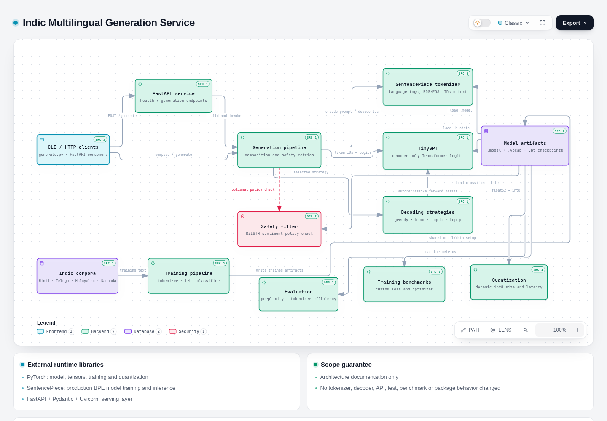
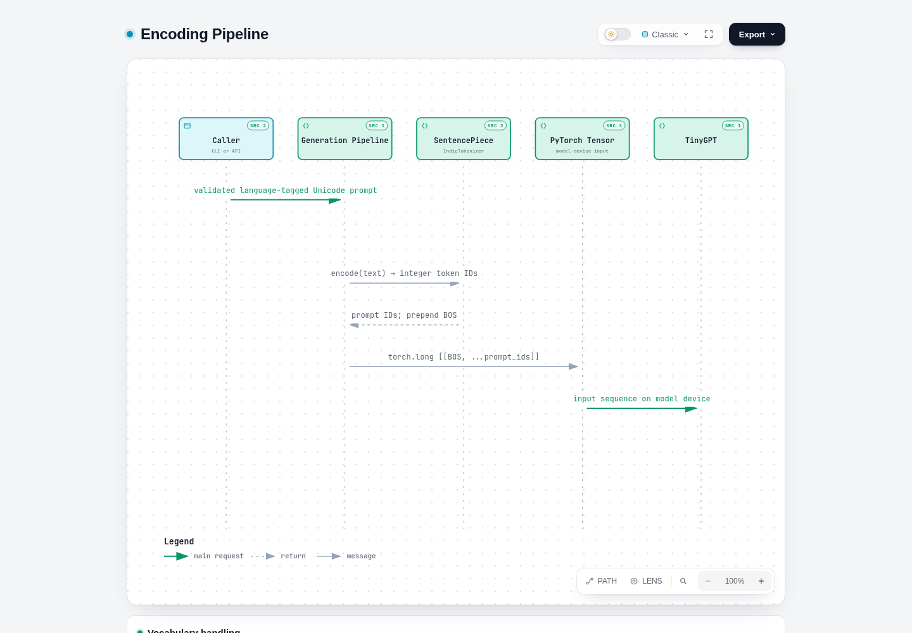
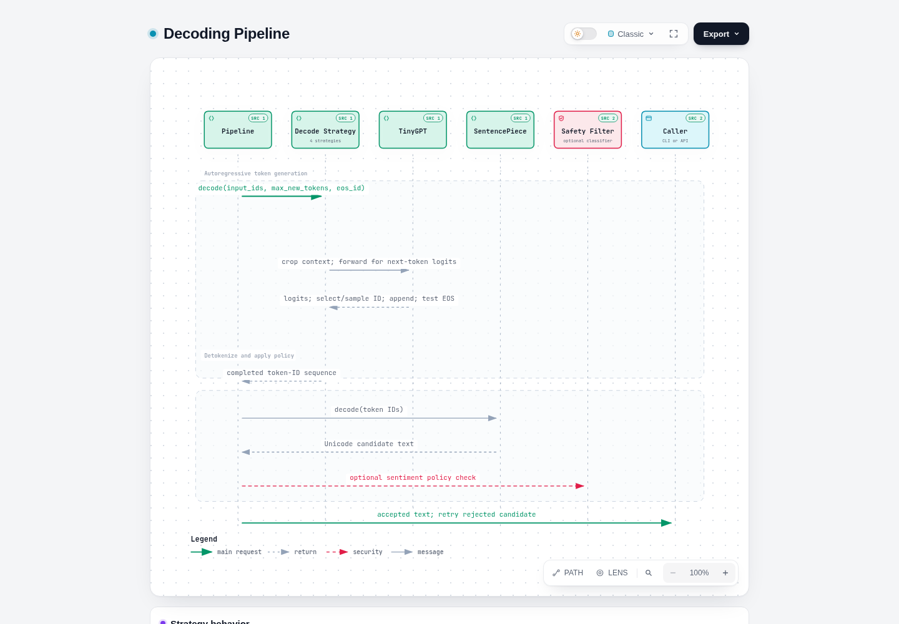

# Interactive architecture documentation

This directory contains source-backed, standalone architecture views for the repository at commit `5bb428e9b1c8e031e6d78ef8caa8a9ad26614fc8`.

| Artifact | Purpose |
|---|---|
| <br>[Interactive HTML](tokenizer-architecture.html) · [JSON source](tokenizer-architecture.json) | Runtime modules, training paths, artifacts, evaluation, benchmarks, quantization, and actual external libraries |
| <br>[Interactive HTML](encoding-flow.html) · [JSON source](encoding-flow.json) | Prompt validation, SentencePiece encoding, BOS insertion, tensor creation, and model input |
| <br>[Interactive HTML](decoding-flow.html) · [JSON source](decoding-flow.json) | Strategy selection, autoregressive logits loop, EOS handling, text decoding, and optional safety retries |

## Evidence and scope

The diagrams were authored from the repository's Python source, configuration, tests, and dependency manifest. Source links in each view point to the file supporting the component or relationship. The views do not assert infrastructure, databases, queues, cloud services, or external APIs that are absent from the code.

The term **decoding** has two distinct meanings in this project:

1. `decoding/strategies.py` selects new token IDs from TinyGPT logits.
2. SentencePiece converts the final token-ID sequence back to Unicode text.

Both stages are shown separately to avoid conflating generation strategy with tokenizer detokenization.

## Regenerating with Archify

Archify is documentation tooling only and is intentionally absent from `requirements.txt`. Install/use it in a documentation workspace, then validate and render the checked-in JSON:

```bash
npx skills use tt-a1i/archify@archify --agent codex

# With an Archify checkout or installed skill path:
node /path/to/archify/bin/archify.mjs finalize architecture \
  docs/architecture/tokenizer-architecture.json \
  docs/architecture/tokenizer-architecture.html \
  --repo-root . --quality showcase --json
```

Archify currently produces one typed artifact per view. The two flow pages are checked-in standalone interactive documents based on the same verified source trace; when editing their topology, regenerate them as Archify sequence/workflow artifacts and re-check every source claim.

## Validation checklist

- Open every HTML file directly in a browser; no web server or project runtime is required.
- Use the view controls and click each node to verify source links.
- Confirm every relative repository link resolves.
- Validate the JSON with Archify against the pinned repository revision.
- Run the existing test suite after documentation edits: `pytest tests/ -v`.

No generated page is imported by Python, included in the Docker runtime, or required to install/use the project.
